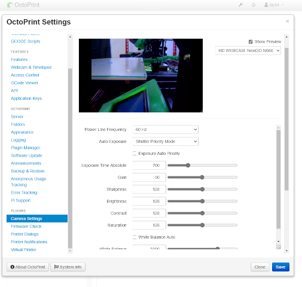

# OctoPrint-ExternalCameraSettings

[](https://github.com/Didstopia/OctoPrint-ExternalCameraSettings/releases/latest) [](https://github.com/Didstopia/OctoPrint-ExternalCameraSettings/releases)

---

**NOTICE:** _This is a fork of [The-EG](https://github.com/The-EG)'s [OctoPrint-CameraSettings](https://github.com/The-EG/OctoPrint-CameraSettings) plugin, designed exlusively for controlling cameras running on remote systems._

---

## Description

<!-- TODO: Add a new screenshot -->
<!---->

<!-- FIXME: Rewrite the description, be as brief as possible! -->

External Camera Settings allows a user to interactively change camera settings by running `v4l2-ctl` on the backend. This method should work for any Linux environment, including OctoPi, as long as the camera is attached to the same device running OctoPrint.

## Installation

**WARNING:** _This plugin is still in development, and may not work as expected. This includes documentation, such as for installation and usage, and may not be available on OctoPrint's plugin manager yet._

<!-- TODO: Outline any necessary requirements for OctoPrint and remote host-->
<!-- TODO: Outline the usage with remote hosts, eg. via SSH -->

<!-- TODO: Figure out how to eventually publish plugins to the plugin manager -->

~~Install via the bundled [Plugin Manager](https://docs.octoprint.org/en/master/bundledplugins/pluginmanager.html) or~~ manually using the following URL:

```html
https://github.com/Didstopia/OctoPrint-ExternalCameraSettings/archive/main.zip
```

Note that the URL above is for the latest development version and may be more unstable and/or buggy than the tagged release versions, ~~so installation through the [Plugin Manager](https://docs.octoprint.org/en/master/bundledplugins/pluginmanager.html) is generally preferred~~.

## Usage

<!-- TODO: Write basic usage instructions here -->

_Not yet implemented._

## License

See [LICENSE](LICENSE).

Original plugin author: [The-EG](https://github.com/The-EG)
